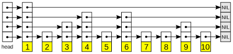

# Skip List

The skip list is a probabilistic data structure that makes some of its decisions at random. While the skip list is not guaranteed to provide good performance, it will provide good performance with extremely high probability.

## Operations

1. **Insert:** `void insert(e)` - Inserts element `e` into the skip list.
2. **Delete:** `delete(e)` - Deletes all occurrences of the element `e` if it is present in the skip list.
3. **Search:** `bool search(e)` - Returns true if element `e` is present in the skip list, otherwise returns false.
4. **Count Occurrence:** `int count_occurrence(e)` - Returns the count of occurrences of the element `e`. For example, if the skip list has elements: 1, 1, 2, 2, 2, 3, `count_occurrence(2)` will return 3, and `count_occurrence(734)` will return 0.
5. **Lower Bound:** `T lower_bound(e)` - Returns the first element that is greater than or equal to `e`. If no such element exists, return the default value for type `T`. For example, if the skip list has elements: 1, 1, 2, 2, 2, 3, `lower_bound(2)` will return an element corresponding to 2, i.e., the 3rd element from the left. If the skip list has elements: 1, 1, 2, 5, 6, 6, 7, `lower_bound(3)` will return an element corresponding to 5, i.e., the 4th element from the left.
6. **Upper Bound:** `T upper_bound(e)` - Returns the first element that is greater than `e`. If no such element exists, return the default value for type `T`. For example, if the skip list has elements: 1, 1, 2, 2, 2, 3, `upper_bound(2)` will return an element corresponding to 3, i.e., the last element from the right. If the skip list has elements: 1, 1, 2, 5, 6, 6, 7, `upper_bound(7)` will return 0, i.e., the default value for the type of element `e` (integer in this case).
7. **Closest Element:** `T closest_element(e)` - Returns the element closest to `e`. If no such element exists, return the default value for type `T`. For example, if the skip list has elements: 1, 1, 2, 2, 2, 5, 7, `closest_element(2)` will return 2, `closest_element(3)` will return 2, `closest_element(4)` will return 5, `closest_element(-1472)` will return 1, and `closest_element(6)` will return 5 (If there are multiple closest elements present, return the minimum).
